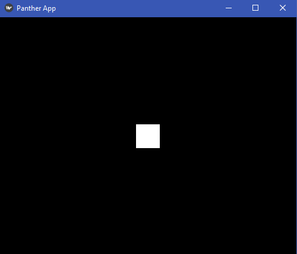

# Installation

Installing Panther is easy, simple execute:
```
pip3 install git+https://github.com/tfff1OFFICIAL/PantherUI@master
```
NOTE: git must be installed for this to work

# Your first application

Create a file named `first.py`, with the following:

```python
import panther
from panther import graphics
```

## Events

Most of Panther's API is around things called 'events', these are essentially functions which are called every time something happens.

Some key events you need to listen for are the 'load', 'update', and 'draw' events.

To 'subscribe' to an event, simply add:

```python
@panther.events.on("load")
def load_event():
    # code to execute when the load event is triggered
```

or, if you'd prefer:

```python
def load_event():
    # code to execute when the load event is triggered
    
panther.events.add("load", load_event)
```

So, what do these events mean?

This exerpt from the [event reference](event_reference), tell us what the 'load', 'update', and 'draw' events are for:

| event name | triggered | parameters |
| ---------- | ----------- | ---------- |
| load | when the view has loaded | () |
| update | every frame, for updating local application variables | (dt: float) |
| draw | every frame (after update), for drawing shapes and data on the screen | () |

## Drawing

The canvas is usually cleared every frame (dependent on config), so draw is executed to draw everything, no matter whether it's moved or not.

the `panther.graphics` module provides a nice interface for drawing things on the canvas, which we're going to use to draw a square.

First, we need to subscribe to the 'draw' event:

```python
@panther.events.on("draw")
def draw():
    ...
```

now, we want to draw a square which is 40 pixels wide, and is positioned at the centre of the screen, to do this we simply add the code:

```python
graphics.rectangle(
    x=panther.conf.width / 2 - 20,
    y=panther.conf.height / 2 - 20,
    width=40,
    height=40
)
```

this code is quite self-explanatory.

for x we're getting half the width of the window, since we want to centre the square.

The reason for the `-20` here is because co-ordinates refer to the position of the bottom left corner of the square, so we need to take half of it's width from half of the screen to properly centre the square.

To start Panther, we need to finally add the line:
```python
panther.start()
```

If you run this code you should see a window appear which look like:



## Movement

Now a white square is great, but I want it to move...

To achieve this we'll need to add an 'update' event listener function (for best practice that is - technically you can do update operations in draw).

This function will change the global variables square_move_x and square_move_y.

Like so:
```python
square_move_x = 0
square_move_y = 0

@panther.events.on('update')
def update_handler(dt):
    global square_move_x, square_move_y
    
    if square_move_x != panther.conf.width / 2:  # if the square is still on the screen
        square_move_x += 1
    else:
        square_move_x = 0
        
    
    if square_move_y != panther.conf.height / 2:  # if the square is still on the screen
        square_move_y += 1
    else:
        square_move_y = 0
```

If we now modify our draw function to take note of these new variables:

```python
@panther.events.on('draw')
def draw():
    global square_move_x, square_move_y
    
    graphics.rectangle(
        x=panther.conf.width / 2 - 20 + square_move_x,
        y=panther.conf.height / 2 - 20 + square_move_y,
        width=40,
        height=40
    )
```

we should now see the square move around the screen - neat!

## Key handling

What if we want the square the stop moving when we press the space bar?

Panther provides an optional simplified API for working with the keyboard, as well as a lower-level event system.

The simplified API will be perfect for this task, and is much cleaner to use.

First, import it at the top of the script by adding:
```python
from panther import key
```

then, we can simply modify our 'update' event handler like so:
```python
@panther.events.on('update')
def update_handler(dt):
    global square_move_x, square_move_y
    
    if not key.down("spacebar"):
        if square_move_x != panther.conf.width / 2:  # if the square is still on the screen
            square_move_x += 1
        else:
            square_move_x = 0
            
        
        if square_move_y != panther.conf.height / 2:  # if the square is still on the screen
            square_move_y += 1
        else:
            square_move_y = 0
```

self explanatory - the movement code now only executes is the "spacebar" key is not down.

## Wrapping up

Congrats - you've just developed your first application using panther!
The full code for this section can be found at [https://github.com/tfff1OFFICIAL/PantherUI/blob/master/examples/getting_started_demo.py](https://github.com/tfff1OFFICIAL/PantherUI/blob/master/examples/getting_started_demo.py)
